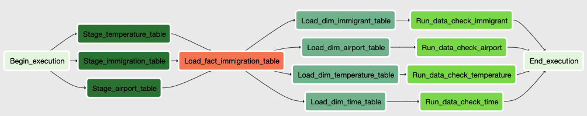

# Data Engineering Pipeline - Exploratory Analysis for Weather Data, Immigration Statistics, and Demographic Population

### Overview

#### 1. Scope of Works
The ETL pipeline was build to  to provide *__exploratory__* data in order to analyse and correlate the immigration pattern, climate changes,  and population difference in the world.

#### 2. Purpose 
- __*Exploratory*__ in nature, the data can be used to support or refute the research questions, general objectives, or business questions of the end-users.

#### 4. Possible Business Questions
- How much does immigration contribute to population growth in a certain place?
- Is the immigration pattern driven by weather changes?
- What primary destination country/state of the immigrants?
- Does weather affect the population density of the certain area?

#### 3. Applicable SQL Queries
- How many people move in the certain place in a given year?
- What is the temperature of the country during the movement coming in and coming out of the people?
- What is the most destinated city/state of the immigrants?
- Are there temperature changes relation to the migration pattern?

### Data Sources
The datasets sources are:
- __I94 Immigration Data__: 

    | Atribute | Content |
    | ------------ | -------- |
    | Description |  International visitor arrival statistics by world regions and select countries (including top 20), type of visa, mode of transportation, age groups, states visited (first intended address only), and the top ports of entry (for select countries).  |
    | meta-data   | SAS format (.sas7bdat), __3,096,313 rows__, 47 MB (in parquet format), 28 columns |
    | source   | [US National Tourism and Trade Office](https://travel.trade.gov/research/reports/i94/historical/2016.html)  |
    | data transformation | Create a mapping of the values for headers and content using the description in I94_SAS_Labels_Descriptions.SAS  |
    | data impression | Data have lots of invalid codes, also the contents is have MAPPINGS, thus in order to make sense of it, the viewer have to constantly refer to the valueset description. |

    Screenshot
        
    
- __World Temperature Data__: 

    | Dependencies | Versions |
    | ------------ | -------- |
    | Description | Data points for average temperate by country  |
    | meta-data   | CSV format, 22.7 MB, 5 csv files, 8,599,212 rows, 6 columns     |
    | source   | [Kaggle](https://www.kaggle.com/berkeleyearth/climate-change-earth-surface-temperature-data)   |
    | dataset | [climate-change-earth-surface-temperature-data/GlobalLandTemperatureByCountry.csv](https://www.kaggle.com/berkeleyearth/climate-change-earth-surface-temperature-data/download) |
    | data transformation | Subset of data was filtered only for the country to United States since immigration data is also limited to US country   |
    | data impression | data is generally clean, though not significant in this pipeline, the Latitude and latutitude should be transformed to float values |

    Screenshot
        


- __U.S. City Demographic Data__: 

    | Dependencies | Versions |
    | ------------ | -------- |
    | Description | Demographics of all US cities and census-designated places with a population greater or equal to 65,000.  |
    | meta-data   | 1.3 MB, JSON format, 2,891 rows,  12 columns |
    | source   | [ OpenSoft](https://public.opendatasoft.com/explore/dataset/us-cities-demographics/export/) |
    | dataset | [us-cities-demographics.json](https://public.opendatasoft.com/explore/dataset/us-cities-demographics/download/?format=json&timezone=Asia/Shanghai&lang=en) |
    | data transformation | the column "field" was normalize a to flatten the json object |
    | data impression | data is only for the year __2017__, thus no timeline comparison can be made |

    Screenshot
        

- __Airport Code Table__:

    | Dependencies | Versions |
    | ------------ | -------- |
    | Description | International airport codes and corresponding cities  |
    | meta-data   | 6.1 MB, CSV format, 55,819 rows, 12 columns |
    | source   | [DataHub.io](https://datahub.io/core/airport-codes#resource-airport-codes_zip)   |
    | dataset | [airport-codes_csv.csv](https://datahub.io/core/airport-codes/r/airport-codes.csv) |
    | data transformation | none   |
    | data impression   | data is relatively clean, but there is no iota_code mapping which is very vital if referencing to immigration data. Thus, unfortunately only the city/country/state/municipality was used as reference key - which is not ideal  |

    Screenshot
        

## Data Analysis, Profiling, ang Cleaning and Processing
- Each datasets were transformed manually (rather than automatic pipeline) for reasons that each data source needs individual manipulation and approach. 
- Unavoidable manual editing of data was also done using __*OpenRefine*__ tool and __*Excel Spreadsheet*__. The different file formats of the raw data were converted to JSON files for uniformity. Only the relevant and related fields were included in the data migration of the processed data to minimize overhead.
- Data analysis and profiling were done using Python, Pandas, Dask in __*Jupyter notebook*__. 

## Data Storage/Database

#### 1. *Database Design*


##### *Data Model Design Rationale*
The schema design was intended for the purpose of answer the listed possible business questions above. 
The fact table was intentionally formulated to join the dimensional fields coming the airport, immigration, and weather data. Another more appropriate Fact Table/s may be created to answer different business question.

### *__CAVEAT__* 
The following were the limitations of the schema due lacking data fields:

- All relational constraints were also loosened and not enforced as the big data is not totally clean - all efforts were already both manual and programatic were done in cleaning process. Strict enforcement of relations would keep the pipeline fail. 
- The field "city" was used as reference keys, though not best practices - this was inevitable because there was not __"iota_code"__ mapping to __"airport_code"__. This referencing is obviously not the best practices and not suitable for production grade.
- The __arrival date__ field in the __i49 Immigration Data__ as used as the reference key to time dimension. Unfortunately the raw *SAS date format* is only convertable to DATE type, ideally the time dimension reference key should be timestamp
- Dimensional table should contain all relevant fields that can be reused for other fact table reference. But for the purpose of minimizing overhead on compute and network latency, only the relevant fields for the __business questions__ abovementioned were included

But for the purpose of the pipeline design, all of these warnings were hesitantly implemented. Nevertheless the data challenges and pipeline design were enlightening.

#### 2. *Data dictionary*

## ETL Pipeline

##### Datasets to S3 Pipeline diagram


##### S3 to Redshift Pipeline diagram


## Tools and technologies 
- __OpenRefine__ - For manual data cleaning from raw data to processed data.
- __Amazon S3__ - For storing different structure and file formats from different data sources.
- __Amazon Redshift__ - For storing data in more structured schema using Star-Schema approach or dimentional modeling.
- __Apache Spark__ - For production processing data from the big data SAS and csv files to dataframes and convert them to the more readable json data files.
- __Dask__ - For local processing data from the big data SAS and csv files to dataframes and convert them to the more readable json data files.
- __Apache Airflow__ - For automating the Extract-Load-Trasnform pipelines and workflows.

### Installation

### Workflow/Process
1. Configure your working environment
    ```
    source ~/<path-to-airflow-virtual-environment>/bin/activate
    ```
2. Run the script to initialize airflow
    ```
    airflow initdb
    airflow webserver -p <available-web-port>
    ```
3. If applicable, on separate terminal run the scheduler
    ```
    airflow scheduler
    ```
4. Configure your __AWS credentials__ in the airflow UI.
    - Click on the __Admin tab__ and select __Connections__.
    - Under __Connections__, select __Create__.
    - In the Create tab enter the following creds:
        - Conn Id: `aws_credentials`
        - Conn Type: `Amazon Web Services`
        - Login: Your `<AWS Access Key ID>`
        - Password: `<Your AWS Secret Access Key>`
4. Configure your __Redshift credentials__ in the airflow UI.
    - Click __Admin tab__ and select __Connections__.
    - Under __Connections__, select __Create__.
    - On the new create page add the following:
        - Conn Id: `redshift`
        - Conn Type: `Postgres`
        - Host: `<endpointof your redshift cluster>`
        - Schema: `<Redshift database name>`
        - Login: `<Database username>`
        - Password: `<Database password>`
        - Port: `5439`
    - Click save
1. Activate the DAG *__datasets_to_s3__* to upload the processsed data to S3 Bucket
1. Activate the DAG *__s3_to_redshift__* to upload the s3 to Redshift Dimensional Model 

### Suggestion for data update frequency
- The data should be updated daily only for the constantly changing data. Use append-only function in contrast to clean and dump approach.

### Change Requirement and Scope Scenarios
- Data increases by __100x__ :
    - Compress the s3 data using _Avro_ format
    - Logically partition data by appropriate and applicable concept
    - Increase the storage capacity for Redshift.
    - Increase the node clusters for Spark for Processing.
    - Use of partition and clustering keys.
    - Co-locate or have near proximity on the S3 and Redshift servers
    
- Pipelines were required on __daily basis by 7am__:
    - schedule daily only the task that migrates volatile and constanly changing data (e.g. Weather and immigraiton data).
    - update the data extraction script with date boundaries so as not to peform truncate-and-dump pattern
- Database needs to be accessible by __100+ people__:
    - If necessary for the analytics team, use Cassandra to apply the "1 report 1 table" principle.
    - If applicable, create a Data Mart for each department.
    - Configure to auto scale the capacity of Redshift

### Future Works and Data Improvement
- __I94 Immigration Data__:
    - Expand the data on immigration and not limit only to United States of America
- __Airport Code Data__:
    - iota_code column is empty, it would be very useful to match with the iota_code in i49 Immigration Data
- __U.S. City Demographic Data__:
    - Data captured is only for year 2017, if other years are present - historical comparison on the weather changes and population growth due to immigration would be feasible
